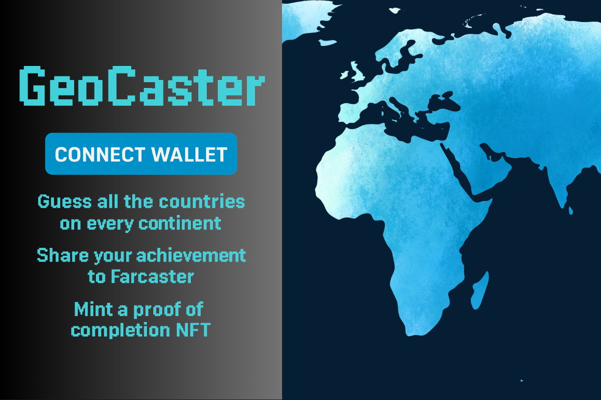

<p align="center">
  
</p>

<h1 align="center">🗺️ GeoCaster – Continent Quiz on Farcaster & Arbitrum</h1>

<p align="center">
  <a href="https://vitejs.dev"></a>
  <a href="https://farcaster.xyz/?launchFrameUrl=https%3A%2F%2Fge-z3kf.onrender.com%2F"></a>
  <a href="https://arbitrum.io"></a>
  
</p>

<p align="center">
  <b>Guess all the countries on every continent, mint your GeoCaster NFT on Arbitrum, and share your achievement to Farcaster!</b>
</p>

## ✨ Live Demo

> 🚀 **Try it now:** [GeoCaster Mini App](https://farcaster.xyz/miniapps/w28yvS34f1Xq/geocaster)



## 🎯 Features

- 🌍 **Continent quiz:** Guess all countries on each continent
- 🏅 **Mint your GeoCaster NFT** on Arbitrum when you complete the challenge
- 🟣 **Share your results to Farcaster** via ComposeCast
- 🚀 **Progress tracking and onboarding** for new users

## 🛠️ Quick Start

```bash
# 1. Clone the repo
$ git clone https://github.com/hummusonrails/ge.git
$ cd ge

# 2. Install dependencies
$ npm install

# 3. Run locally
$ npm run dev
```

> 💡 **Tip:** Update your `public/.well-known/farcaster.json` and `<meta name="fc:frame">` in `index.html` with your production URL before deploying!

## 🧩 Farcaster Mini App Integration

### 📄 Manifest (`farcaster.json`)

- Served from `public/.well-known/farcaster.json`
- Fields: `name`, `description`, `iconUrl`, `homeUrl`, `splashImageUrl`, `requiredCapabilities`
- Update `homeUrl` and `splashImageUrl` to your deployed app URL before launch
- Serve a static image for `splashImageUrl` (e.g., `/splash.png`)

### 🖼️ Frame Embed (`fc:frame`)

Add this to your `index.html` to make your app shareable in Farcaster feeds:

```html
<head>
  <!-- other tags -->
  <meta name="fc:frame" content='{"version":"next","imageUrl":"/og-image.png","button":{"title":"Open","action":{"type":"launch_frame","name":"GeoCaster","url":"https://your-app-url.xyz"}}}' />
</head>
```

## 💻 Tech Stack

- [Vite](https://vitejs.dev)
- [React](https://react.dev)
- [Tailwind CSS](https://tailwindcss.com)
- [@farcaster/frame-sdk](https://github.com/farcasterxyz/frames/tree/main/packages/frame-sdk)
- [wagmi.sh](https://wagmi.sh/)
- [viem](https://viem.sh/)
- [Jotai](https://jotai.org/)

## 🤝 Contributing

Contributions, issues and feature requests are welcome!<br>
Feel free to check [issues page](https://github.com/hummusonrails/ge/issues) or submit a pull request.

1. Fork the repo
2. Create your feature branch (`git checkout -b feature/AmazingFeature`)
3. Commit your changes (`git commit -m 'Add some AmazingFeature'`)
4. Push to the branch (`git push origin feature/AmazingFeature`)
5. Open a pull request

## 🌐 Community & Support

- [Farcaster](https://farcaster.xyz/)
- [Arbitrum](https://arbitrum.io/)
- [File an Issue](https://github.com/hummusonrails/ge/issues)

<p align="center">
  
  
</p>

<p align="center">
  <b>Made with ❤️ for the Farcaster & Arbitrum community</b>
</p>
